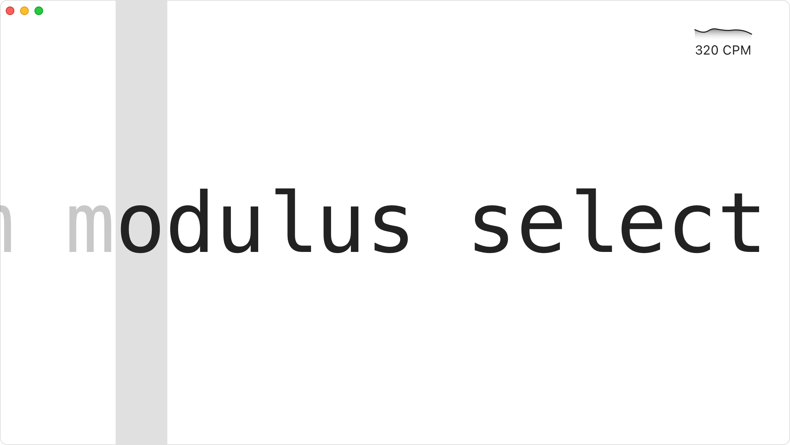

# Typetific

An application that was made to help you to practice your keyboard typing skills. It is easy to use, multiplatform
open-source app.

Currently, it is under heavy development. It uses [Qt for Python](https://wiki.qt.io/Talk:Qt_for_Python) framework
and [Python](https://python.org/) programming language to render graphics and implement human interactions interface.