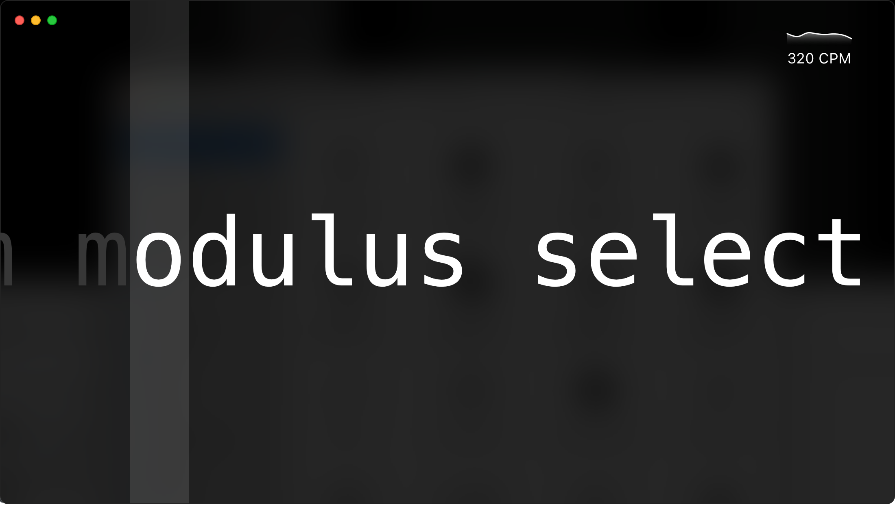

#  Typetific

An application that was made to help you to practice your keyboard typing skills. It is easy to use, multiplatform
open-source app.



Currently, it is under heavy development. It uses [Qt for Python](https://www.qt.io/qt-for-python) framework
and [Python](https://python.org/) programming language to render graphics and implement human interactions interface.

## Build

For assembling an executable for Windows and macOS we use [PyInstaller](https://pyinstaller.org/) tool. Default build
configuration is in the `build.spec` file. To start building you simply need to execute following command:

```bash
$ pyinstaller build.spec
```

## Requirements

We use [Qt for Python](https://www.qt.io/qt-for-python) framework (`PySide2`) as our main interface building framework.
Also, we use libraries such as `english-words` to add those as a dictionaries. However, all the requirements are defined
in the `requirements.txt` file. To install those, use the following command:

```bash
$ pip install -r requirements.txt
```

We recommend using virtual environment.